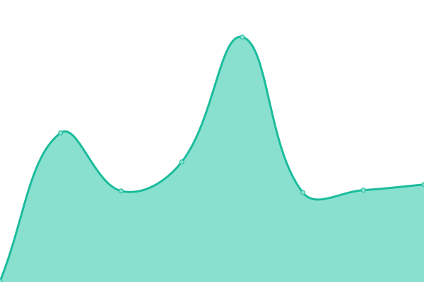

# [📈 Live Status](https://status.svenshen.com): <!--live status--> **🟩 All systems operational**

This repository contains the open-source uptime monitor and status page for [sven shen](https://www.svenshen.com), powered by [Upptime](https://github.com/upptime/upptime).

With [Upptime](https://upptime.js.org), you can get your own unlimited and free uptime monitor and status page, powered entirely by a GitHub repository. We use [Issues](https://github.com/sven0219/statusPages/issues) as incident reports, [Actions](https://github.com/sven0219/statusPages/actions) as uptime monitors, and [Pages](https://status.svenshen.com) for the status page.

<!--start: status pages-->
<!-- This summary is generated by Upptime (https://github.com/upptime/upptime) -->
<!-- Do not edit this manually, your changes will be overwritten -->
<!-- prettier-ignore -->
| URL | Status | History | Response Time | Uptime |
| --- | ------ | ------- | ------------- | ------ |
|  [Blog](https://www.svenshen.com) | 🟩 Up | [blog.yml](https://github.com/sven0219/statusPages/commits/HEAD/history/blog.yml) | 

 168ms
     
 | 

<a href="https://status.svenshen.com/history/blog">100.00%</a>
    

|  [BT](http://bt.bomsven.cn) | 🟩 Up | [bt.yml](https://github.com/sven0219/statusPages/commits/HEAD/history/bt.yml) | 

 1138ms
     
 | 

<a href="https://status.svenshen.com/history/bt">100.00%</a>
    

|  [Test Blog](http://www.bomsven.cn) | 🟩 Up | [test-blog.yml](https://github.com/sven0219/statusPages/commits/HEAD/history/test-blog.yml) | 

 1490ms
     
 | 

<a href="https://status.svenshen.com/history/test-blog">100.00%</a>
    

|  [Love](http://love.bomsven.cn) | 🟩 Up | [love.yml](https://github.com/sven0219/statusPages/commits/HEAD/history/love.yml) | 

 837ms
     
 | 

<a href="https://status.svenshen.com/history/love">100.00%</a>
    

|  [CMS](http://cms.bomsven.cn) | 🟩 Up | [cms.yml](https://github.com/sven0219/statusPages/commits/HEAD/history/cms.yml) | 

 1304ms
     
 | 

<a href="https://status.svenshen.com/history/cms">100.00%</a>
    

<!--end: status pages-->

[**Visit our status website →**](https://status.svenshen.com)

## 📄 License

- Powered by: [Upptime](https://github.com/upptime/upptime)
- Code: [MIT](./LICENSE) © [sven shen](https://www.svenshen.com)
- Data in the `./history` directory: [Open Database License](https://opendatacommons.org/licenses/odbl/1-0/)
